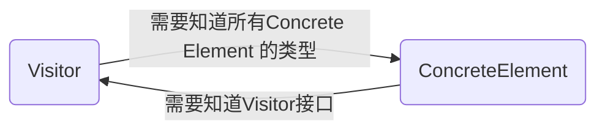

# AST 的访问

> 本文的有关代码在 [这里](https://github.com/AlmondRyan/Ryntra-Project/tree/master/Compiler/AST)

我们前面成功的设计了 AST 的节点、构建了属于我们自己的 AST，接下来就是设计一个东西来访问我们的 AST。

## 非环形访问者模式

我们采取 Acyclic Visitor（非环形访问者）模式。此时你可能会问：什么是 Acyclic Visitor？那么好，我们现在来详细解释一下。

### 经典的 Visitor

经典的 Visitor 用于在稳定数据结构上定义新的操作，而不修改数据结构。核心的结构是：

- `Visitor` 接口：为每个具体的元素类声明一个 `visit()` 方法
- `ConcreteVisitor`：实现 `Visitor` 的接口，定义针对每个元素的具体操作
- `Element` 接口：声明 `accept(Visitor)` 方法
- `ConcreteElement`：实现 `accept()` 方法，在 `accept()` 中调用 `visitor.visit()`

这样做的目的很简单，将操作和实现分离，这样就可以不修改元素类增加新的操作。

当然，坏处也十分明显，首先就是循环依赖（Circular Dependency）问题：



Visitor 明确需要知道 Concrete Element 的类型这样才能给它生成 `visit()` 方法，而 Concrete Element 又需要 Visitor 的接口才能实现对应的行为... 死循环诶，这您受得了吗。

这种双向依赖导致：

- 添加新的 Element 特别困难，因为你添加一个 Element 会导致所有 Visitor 接口变动，如果不改你将获得 "类为 abstract" 的提示并且编译报错，并且违反了开闭原则（OCP）
- 耦合过强，Element 和 Visitor 之间紧紧绑定在一起，改动任何一个都会影响另一个

此时，Acyclic Visitor 模式就来解决这个问题。

### Acyclic Visitor 模式的核心思想

他来干什么？解决经典 Visitor 模式的循环依赖问题。

他怎么实现？

- 为每个 ConcreteElement 定义自己的 Visitor 子接口，这个接口只包含一个针对这个类型的 `visit()` 方法
- Visitor 基类的接口仅作为标记用，没有任何具体方法
- 每个 Visitor 需要实现多个 Element Visitor 接口，从而实现针对不同 Element 的操作
- Element 的 `accept()` 方法接受 Visitor 基接口，方法内部用 `dynamic_cast<>` 检查传入的 Visitor 是否实现对应的 `visit()` 接口，如果实现了，就调用；没实现，就报错

此时，Element 不再依赖包含所有 `visit()` 方法的 Visitor，此时只依赖 Visitor 标记接口和他自己对应的子接口，Visitor 接口不再耦合所有的 Element 类型。直接达成目标。

****

## 基类代码实现

说了这么多，我们直接来看实战。

首先，我们需要一个公共祖先 `IVisitor`，他没有任何方法，仅包括一个虚析构函数用于实现多态（Polymorphism）：

```Cpp
class IVisitor {
public:
    virtual ~IVisitor() = default;
};
```

接下来，为每个节点类型生成一个属于自己的访问者接口，注意：**没有继承 `IVisitor`**。

```Cpp
template <typename T>
class Visitor {
public:
    virtual ~Visitor() = default;
    virtual void visit(T &node) = 0;
};
```

那么此时你可能会问，为什么不继承 `IVisitor`？这是一个非常好的问题：

1. 避免菱形继承、虚继承的开销：如果 `Visitor<Tp>` 继承 `IVisitor`，具体访问者多重继承多个 `Visitor<Tp>`，必然形成菱形继承（`IVisitor` 出现多次），C++ 标准要求这样使用虚继承解决二义性和内存布局混乱，但是虚继承并非零开销。如果不继承，规避了这些所有的问题
2. 接口职责清晰：`IVisitor` 作为标记接口，`Visitor<Tp>` 作为操作接口，两种功能正交，符合单一职责原则

!!! warning "注意"

    任何希望被 `accept()` 接收的访问者必须公开继承 **IVisitor**，否则无法将实例绑定到 `IVisitor &`，导致编译错误。

****

## `accept()` 的实现

我们在这里举个例子，以 `StringLiteralNode` 的 `accept()` 举例子：

```Cpp
void StringLiteralNode::accept(IVisitor &visitor) {
    if (auto *v = dynamic_cast<Visitor<StringLiteralNode> *>(&visitor)) {
        v->visit(*this);
    }
}
```

这里看似很难理解，其实特别好理解：

- 把传入的 `visitor` 交叉转型为 `Visitor<StringLiteralNode> *` [^1]
- 如果转型成功（该访问者支持处理 `StringLiteralNode`），就调用他的 `visit()` 方法
- 如果转型失败，则**静默忽略**。这样做的好处是容错率高，允许访问者只关注它感兴趣的节点，而无需实现所有接口。

其他的 `accept()` 类似，比如 `ProgramNode`：

```Cpp
void ProgramNode::accept(IVisitor &visitor) {
    if (auto *v = dynamic_cast<Visitor<ProgramNode> *>(&visitor)) {
        v->visit(*this);
    }
}
```

****

## 自动化生成 Visitor

随着我们的语言越来越复杂，AST 节点也越来越多（比如我们刚刚添加了 `ReturnNode` 和 `IntegerLiteralNode`）。如果每一个 Visitor 都要手动继承所有的 `Visitor<T>` 接口，那将是一场噩梦：

1.  需要手动写几十个继承声明
2.  容易漏掉某个节点类型
3.  重构时维护成本极高

为了解决这个问题，我们提供了一个脚本 `Scripts/GenAllNodesVisitor/GenAllNodesVisitor.py` 以及节点列表 `Scripts/GenAllNodesVisitor/NodesList.txt`。

`NodesList.txt` 包含了所有的 AST 节点名称：

```text
TypeSpecifierNode
StringLiteralNode
IdentifierNode
FunctionCallNode
ExpressionStatementNode
BlockNode
FunctionDefinitionNode
ProgramNode
ReturnNode
IntegerLiteralNode
```

脚本会根据这个列表自动生成 `Compiler/AST/AllNodesVisitor.h`，它大概长这个样子：

```Cpp
class AllNodesVisitor : public IVisitor,
                        public Visitor<TypeSpecifierNode>,
                        public Visitor<StringLiteralNode>,
                        // ... 其他节点
                        public Visitor<ReturnNode>,
                        public Visitor<IntegerLiteralNode>
{
public:
    virtual ~AllNodesVisitor() = default;
    virtual void visit(TypeSpecifierNode &node) override {}
    virtual void visit(StringLiteralNode &node) override {}
    // ... 其他节点的默认空实现
    virtual void visit(ReturnNode &node) override {}
    virtual void visit(IntegerLiteralNode &node) override {}
};
```

这样，我们只需要继承 `AllNodesVisitor`，就可以轻松地创建一个能够访问所有节点的 Visitor 了。

****

## 真实样例

现在，让我们利用 `AllNodesVisitor` 来实现一个简单的 AST 打印器，它能够处理我们需要的新节点 `ReturnNode` 和 `IntegerLiteralNode`。

```Cpp
class ASTPrinter : public AllNodesVisitor {
public:
    // 处理程序节点
    void visit(ProgramNode &node) override {
        std::cout << "ProgramNode" << std::endl;
        // 递归访问子节点
        for (auto &func : node.getFunctions()) {
            func->accept(*this);
        }
    }

    // 处理返回语句
    void visit(ReturnNode &node) override {
        std::cout << "Return Statement" << std::endl;
        if (node.getValue()) {
            std::cout << "  Value: ";
            node.getValue()->accept(*this);
        }
    }

    // 处理整数常量
    void visit(IntegerLiteralNode &node) override {
        std::cout << "Integer Literal: " << node.getValue() << std::endl;
    }

    // 处理字符串常量
    void visit(StringLiteralNode &node) override {
        std::cout << "String Literal: " << node.getValue() << std::endl;
    }
    
    // ... 其他节点的处理
};
```

调用方式依旧简单：

```Cpp
// 假设 root 是我们构建好的 AST 根节点
ASTPrinter printer;
root->accept(printer);
```

通过这种方式，我们可以非常方便地扩展我们的编译器功能（比如语义分析、代码生成），而不需要修改现有的 AST 结构。

****

下一章，让我们深入符号表的创建和使用。

[^1]: 为什么可以从 `IVisitor*` 转换到 `Visitor<StringLiteralNode> *`？需要有一个条件满足：完整对象必须同时派生自 `IVisitor` 和 `Visitor<StringLiteralNode>`，这称作 Cross-Cast
